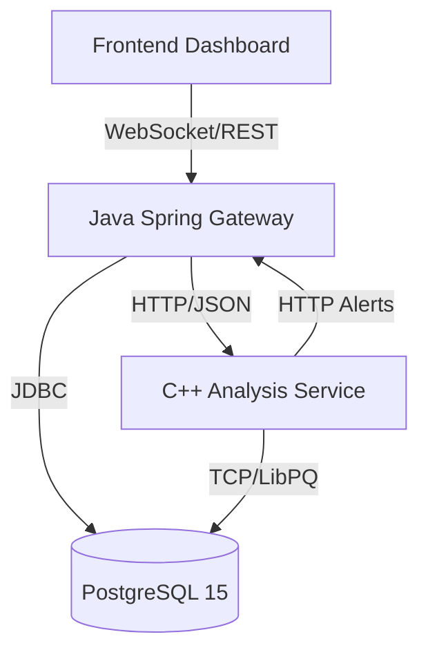
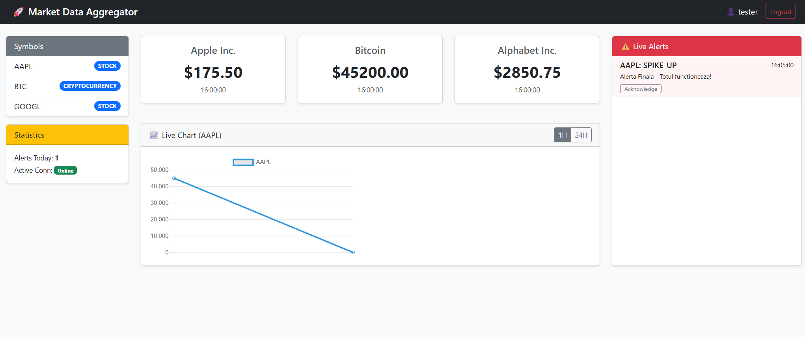

# 🚀 Market Data Aggregator (Financial Platform)

    

A high-performance, real-time financial data aggregation platform designed to process market data, detect anomalies using C++ algorithms, and visualize trends via a WebSocket-enabled dashboard.

## 🏗️ System Architecture

The system follows a microservices-inspired architecture containerized via Docker:



* **Java Gateway (Spring Boot):** Handles Auth (JWT), API REST, WebSockets, and data orchestration.
* **C++ Analysis Service:** Performs heavy computation (SMA, EMA) and anomaly detection (Price Spikes).
* **PostgreSQL:** Persists users, symbols, prices, and alerts.
* **Frontend:** Real-time dashboard using Chart.js and Stomp.js.

## 🛠️ Technologies Used

* **Backend:** Java 21, Spring Boot 3.2.1, Spring Security (JWT), Spring Data JPA, WebSocket (STOMP).
* **Analysis:** C++17, CMake, Custom HTTP Server.
* **Database:** PostgreSQL 15 (Production), H2 (Testing).
* **DevOps:** Docker, Docker Compose, GitHub Actions (CI/CD).
* **Frontend:** HTML5, Bootstrap 5, Chart.js.

## 🚀 Getting Started

### Prerequisites
* Docker & Docker Compose installed.
* (Optional) Java 21 & Maven for local development.

### Installation

1.  **Clone the repository:**
    ```bash
    git clone https://github.com/gabivelican/market-data-aggregator.git
    cd market-data-aggregator
    ```

2.  **Start the application (Production Mode):**
    ```bash
    docker-compose up --build -d
    ```

3.  **Verify services are running:**
    ```bash
    docker ps
    ```
    *You should see 3 containers: `market-gateway`, `market-analysis`, `market-db`.*

### Accessing the Application

| Service | URL | Description |
| :--- | :--- | :--- |
| **Dashboard** | `frontend/index.html` | Open this file in your browser to see live charts |
| **Swagger UI** | [http://localhost:8080/swagger-ui.html](http://localhost:8080/swagger-ui.html) | API Documentation & Testing |
| **Health Check** | [http://localhost:8080/actuator/health](http://localhost:8080/actuator/health) | System Status |

## 🧪 Testing

### Running End-to-End Tests
We have included a Python script to simulate real-time traffic and anomalies:

```bash
# Requires python requests library (pip install requests)
python e2e_test.py
```
*This will create a user, log in, generate price data, force a price spike, and trigger an alert visible in the dashboard.*

### Running Unit Tests (CI/CD)
The project includes a GitHub Actions pipeline that automatically runs:
* Java Unit Tests (JUnit 5 + MockMvc)
* Docker Build Verification
* C++ Compilation Checks

## 📸 Screenshots

### Real-Time Dashboard


### Swagger API Documentation


## 🔧 Troubleshooting

* **Port 8080/5432 already in use?**
    * Stop local services or modify `docker-compose.yml` ports.
* **Database connection failed?**
    * Ensure the `postgres` container is healthy (`docker ps`).
    * Check logs: `docker-compose logs -f market-db`.

## 👥 Authors
* **DevOps Team** - *Serafim Dan Mihai* , *Gabriel Velican*
